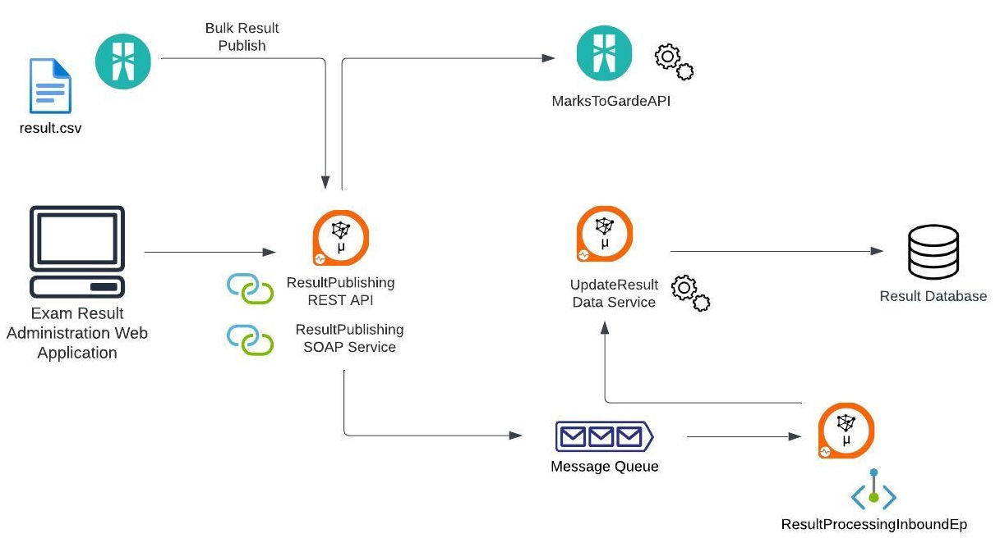
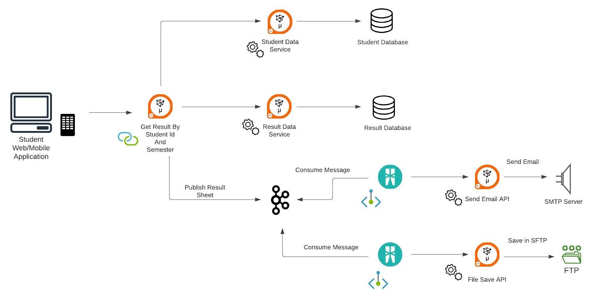

# Integration in Microservice Oriented Landscape

## Overview

Modern organizations often use Microservices Architecture to digitze their application landscape to take advantage of its cloud nativeness and faster go-to-market time due to decentralised nature. While employing this strategy, robust integration becomes vital. Thus it's advatagous for an integration platform to support lightweight runtimes with easier development of integration scenarios with low-code development tools. 

This tutorial will walk you through developing APIs and integrations with low-code tools for WSO2 Micro Integrator and deployment in a distributed microservices landscape. 

## Prerequisites

- WSO2 Micro Inetgrator [v4.2.0](https://wso2.com/micro-integrator/)
- MySQL server [8.0 or higher](https://dev.mysql.com/downloads/mysql/)
- JDK [17](https://jdk.java.net/archive/)
- Apache ActiveMQ [5.18.14](https://activemq.apache.org/components/classic/documentation/download-archives)
- Kafka [2.13-3.6.0](https://kafka.apache.org/downloads)
- Latest version [Ballerina Swan Lake](https://ballerina.io/downloads/) 
- WSO2 Integration Studio [8.2.0](https://wso2.com/micro-integrator/)
- VS Code with Micro Integrator Extension

For development of the artifacts following tools were used

- Integration Studio version [8.2.0](https://wso2.com/micro-integrator/)
- VS Code with Micro Integrator Extension

For testing below tools will be needed. 

- Postman (preferred) or curl
- SoapUI
- MySQL Workbench or any other database client
- FileZilla

A University is taking the first steps to transform their existing 'Result' issuing monolith system into a Microservices landscape. They have identified decentralised integration as a vital requirement to accomplish this task. 

On a high-level University has decided to implement below two scenarios.

1. Result Publishing System

2. Result Fetching and Notification System

